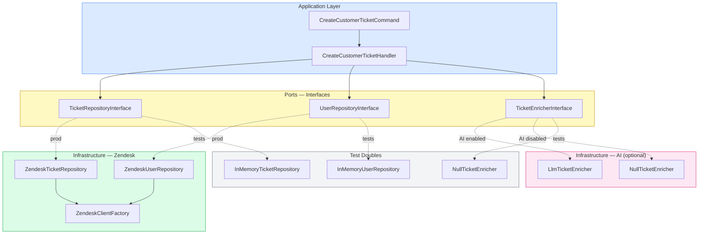
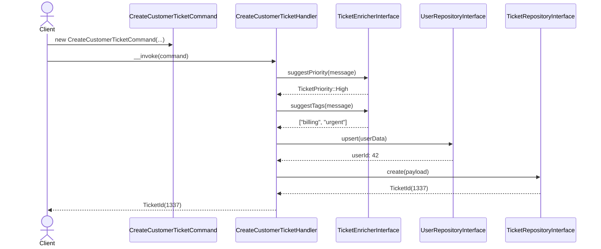
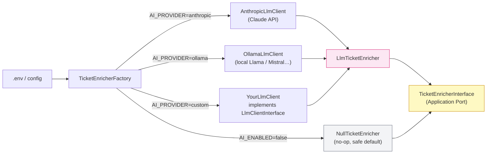

# ZendeskService Refactoring — Mobility Work Technical Challenge

## Table of Contents

1. [Identified Issues (Prioritised)](#identified-issues)
2. [Architecture Decisions](#architecture-decisions)
3. [Project Structure](#project-structure)
4. [AI Integration](#ai-integration)
5. [Running the Tests](#running-the-tests)
6. [Environment Variables](#environment-variables)

---

## Identified Issues (Prioritised)

### 🔴 Critical — Security & Stability

#### 1. Hardcoded Secret Token
```php
// BEFORE — catastrophic security issue
const PRODUCTION_SECRET_TOKEN = '7a960781b588403ca32116048238d01c';
```
A production secret **in source code** will end up in version control. Any developer, contractor, or attacker with repo access owns your Zendesk account. Solution: inject via environment variables.

#### 2. No Error Handling (3 out of 4 methods)
`createCustomerTicket`, `createHotelTicket`, `createPartnersTicket` call `$client->tickets()->create(...)` with zero error handling. A Zendesk API outage silently corrupts the user flow. Only `createPressTicket` has a try/catch — and even that only logs the user ID, not the actual exception message.

#### 3. Dependency Inversion Violation — Direct Instantiation
```php
// BEFORE — impossible to test, impossible to swap
$client = new ZendeskAPI($this->getServiceManager()->get('Config')['zendesk']['subdomain']);
```
`ZendeskAPI` is instantiated 4 times inline. Unit tests are impossible without hitting the real Zendesk API. Solution: inject a `ZendeskClientInterface` via constructor.

---

### 🟠 High — OOP & Design

#### 4. Service Locator Anti-Pattern
```php
$this->getServiceManager()->get('Config')['zendesk']['subdomain']
$this->getServiceManager()->get('service.hotel_contacts')
```
Using the service container as a locator couples the class to the DI framework, hides dependencies, and makes the class impossible to instantiate outside of a Symfony context. Solution: explicit constructor injection.

#### 5. DRY Violation — Client Initialisation Duplicated 4 Times
The entire authentication block is copy-pasted in every method. One config change requires 4 edits. Now centralised in `ZendeskClientFactory`.

#### 6. DRY Violation — User Creation and Subject Truncation Duplicated 4 Times
`$firstName.' '.strtoupper($lastName)` and `strlen($message) > 50 ? substr(…) : $message` are repeated verbatim. Both are now Value Objects (`ContactName`, `TicketSubject`).

#### 7. Single Responsibility Violation — God Class
`ZendeskService` handles: client init, authentication, user upsert, custom field mapping for 4 ticket types, reservation lookup, hotel contact lookup. Each is now its own collaborator.

#### 8. Magic Strings for Custom Field IDs
```php
$customFields['80924888'] = 'customer'; // what is 80924888 ???
```
Now replaced by named constants in `CustomFieldId`.

---

### 🟡 Medium — Type Safety & API Design

#### 9. No Type Declarations
All parameters untyped. Missing types means silent `null` bugs. All signatures now use strict types and `readonly` properties.

#### 10. Unused Parameters
`$gender`, `$country`, `$subject`, `$domainConfig` accepted but never used. Now annotated `@deprecated` with explanation, or removed where confirmed unnecessary.

#### 11. `createCustomerTicket` Returns `true` Unconditionally
The return value carries no information. Handlers now return a typed `TicketId` Value Object.

---

### 🟢 Low — Code Quality

#### 12. Commented-Out Dead Code
```php
//$this->getLogger()->addError(var_export($endUser, true));
```
Dead code belongs in git history, not in source files.

#### 13. `var_export` in Error Logging
Logs the raw user ID instead of the exception message. All error handlers now log `$e->getMessage()` with structured context.

#### 14. Inconsistent Error Handling Strategy
Some methods have try/catch, others don't. Now every infrastructure call is wrapped consistently and translates to a domain exception.

---

## Architecture Decisions

### Hexagonal Architecture (Ports & Adapters)



The **domain** knows nothing about Zendesk or any AI provider. The **application layer** expresses intent via Commands. The **infrastructure layer** adapts external services to domain ports. This means:

- Zendesk can be swapped for Freshdesk by writing a new adapter, touching nothing else
- Unit tests use `InMemoryTicketRepository` — zero HTTP calls, zero credentials needed
- AI enrichment is a separate optional port — pluggable and provider-agnostic

---

### CQRS — Command Flow



---

## AI Integration

AI enrichment is **optional** and **provider-agnostic**. It is controlled entirely by environment variables.

### Provider Selection



### Adding a new provider

Adding support for e.g. OpenAI or Mistral requires exactly two steps:

1. Implement `LlmClientInterface` (one method: `complete(string $system, string $user): string`)
2. Add one `case` in `TicketEnricherFactory`

No application or domain code changes.

### What the AI does

| Method | Input | Output | Fallback |
|---|---|---|---|
| `suggestPriority` | Message text | `TicketPriority` enum | `TicketPriority::Normal` |
| `suggestTags` | Message text | `string[]` | `[]` |
| `generateSubject` | Message + locale | Subject string ≤ 50 chars | First 50 chars of message |

All methods are **advisory only** — any LLM failure returns a safe default and logs a warning. Ticket creation is never blocked.

---

## Project Structure

```
src/
├── Domain/
│   ├── Ticket/
│   │   ├── ValueObject/
│   │   │   ├── TicketSubject.php          # Encapsulates 50-char truncation rule
│   │   │   ├── TicketType.php             # PHP 8.1 enum — replaces magic strings
│   │   │   ├── TicketPriority.php         # PHP 8.1 enum
│   │   │   ├── CustomFieldId.php          # Named constants for opaque numeric IDs
│   │   │   └── TicketId.php               # Typed return value from ticket creation
│   │   ├── Port/
│   │   │   └── TicketRepositoryInterface.php
│   │   └── Exception/
│   │       └── TicketCreationFailedException.php
│   └── User/
│       ├── ValueObject/
│       │   └── ContactName.php            # Encapsulates firstName + LASTNAME formatting
│       └── Port/
│           └── UserRepositoryInterface.php
│
├── Application/
│   ├── Command/
│   │   ├── CreateCustomerTicketCommand.php
│   │   ├── CreateHotelTicketCommand.php
│   │   ├── CreatePressTicketCommand.php
│   │   └── CreatePartnerTicketCommand.php
│   ├── Handler/
│   │   ├── CreateCustomerTicketHandler.php
│   │   ├── CreateHotelTicketHandler.php
│   │   ├── CreatePressTicketHandler.php
│   │   └── CreatePartnerTicketHandler.php
│   └── Port/
│       └── TicketEnricherInterface.php    # AI port — application layer only sees this
│
└── Infrastructure/
    ├── Zendesk/
    │   ├── ZendeskCredentials.php         # Typed config VO — replaces service locator
    │   ├── ZendeskClientFactory.php       # Single place for SDK init (was duplicated 4×)
    │   ├── ZendeskTicketRepository.php    # Adapter: TicketRepositoryInterface → Zendesk SDK
    │   └── ZendeskUserRepository.php      # Adapter: UserRepositoryInterface → Zendesk SDK
    └── Ai/
        ├── AiConfig.php                   # Typed config VO (fromEnvironment / fromArray)
        ├── TicketEnricherFactory.php      # Reads config, wires the right enricher
        ├── LlmTicketEnricher.php          # Provider-agnostic enricher
        ├── NullTicketEnricher.php         # No-op for AI_ENABLED=false
        └── Provider/
            ├── LlmClientInterface.php     # The only contract all LLM providers implement
            ├── LlmProviderException.php
            ├── AnthropicLlmClient.php     # Anthropic Claude adapter
            └── OllamaLlmClient.php        # Ollama (local Llama / Mistral…) adapter

tests/
├── Doubles/
│   ├── InMemoryTicketRepository.php
│   └── InMemoryUserRepository.php
└── Unit/
    ├── Domain/Ticket/ValueObject/
    │   └── TicketSubjectTest.php
    ├── Domain/User/ValueObject/
    │   └── ContactNameTest.php
    └── Application/Handler/
        └── CreateCustomerTicketHandlerTest.php
```

---

## Running the Tests

```bash
composer install
./vendor/bin/phpunit --testdox
```

No Zendesk credentials or AI API key needed — all infrastructure is replaced by in-memory fakes and the `NullTicketEnricher`.

---

## Environment Variables

```env
# Zendesk (required)
ZENDESK_SUBDOMAIN=your-subdomain
ZENDESK_USERNAME=agent@yourcompany.com
ZENDESK_TOKEN=your_api_token

# AI enrichment — AI_ENABLED=false is the safe default, all other vars are optional
AI_ENABLED=false
AI_PROVIDER=anthropic          # anthropic | ollama

# Anthropic (required when AI_PROVIDER=anthropic)
AI_ANTHROPIC_API_KEY=sk-ant-...
AI_ANTHROPIC_MODEL=claude-sonnet-4-20250514   # optional

# Ollama — local, no API key needed (https://ollama.com)
AI_OLLAMA_BASE_URL=http://localhost:11434      # optional
AI_OLLAMA_MODEL=llama3                         # optional

# Shared
AI_MAX_TOKENS=256                              # optional
```
